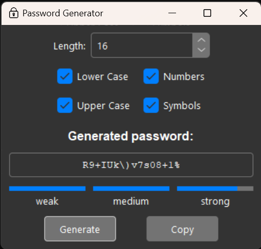

# Password Generator

Lightweight password generator in Python using TKinter.

## Screenshots

| light | dark |
| :---- | :--- |
 | 

## How to Install

Go to to inside **tkpass** folder where the **setup.py** file is, open a terminal and execute the following commad:

```python
pip install .
```

## How to Use

Once tkpass is installed via **pip**, simply execute the following command in a terminal:

```python
python -m tkpass

# default theme is light, for dark theme execute
python -m tkpass -t dark
```

## Themes

This application includes the [Azure](https://github.com/rdbende/Azure-ttk-theme) theme for ttk.
